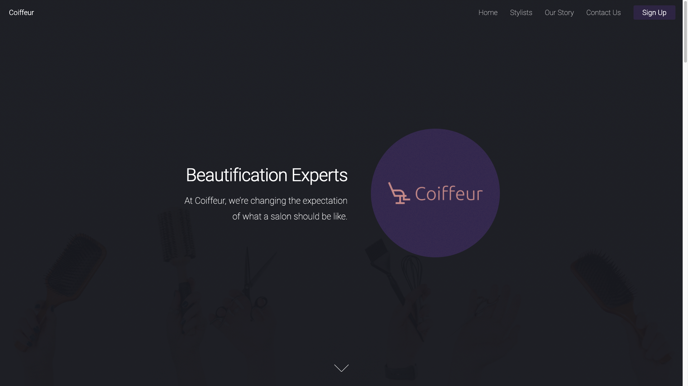

# Donut King : <a target="_blank" href="https://donutking.netlify.app/">Visit Here</a>

### A fully responsive website for an online niche donut shop delivering hand-made donuts to donut enthusiasts.

## Tech used: 

My focus was on simplicity and smooth transitions.

## Optimizations

My next steps for improving this project would be to add more interactivity through choosing from a variety of donuts through a selection-based menu where you can customize your donut box.

## Lessons Learned:

I learned to use CSS transform in a few ways to make the site alive.

## More Projects

<table bordercolor="#66b2b2">
  
  <tr>
    <td width="33.3%"  style="align:center;" valign="top">
<a target="_blank" href="https://github.com/Cesar-Quintero/Cesar-Quintero-Portfolio-Website">Portfolio Website</a>
         
      
    </td>
    <td width="33.3%" valign="top">
<a target="_blank" href="https://github.com/Cesar-Quintero/Coiffeur">Coiffeur</a>
       
        
    </td>
    <td width="33.3%" valign="top">
<a target="_blank" href="https://github.com/Cesar-Quintero/Market_List_App">Market List App</a>
         
      
    </td>
  </tr>
</table>